<h1 align="center">基于SpringBoot疫情期间高校人员管理系统【带论文】</h1>

- <b>完整代码获取地址：从戎源码网 ([https://armycodes.com/](https://armycodes.com/))</b>
- <b>技术探讨、资料分享，请加QQ群：692619798</b>
- <b>作者微信：19941326836  QQ：3645296857</b>
- <b>承接计算机毕业设计、Java毕业设计、Python毕业设计、深度学习、机器学习</b>
- <b>选题+开题报告+任务书+程序定制+安装调试+论文+答辩ppt 一条龙服务</b>
- <b>所有选题地址 ([https://github.com/Descartes007/allProject](https://github.com/Descartes007/allProject)) </b>

## 一、项目介绍

### 本项目为基于SpringBoot疫情期间高校人员管理系统，系统基于角色进行权限控制，典型角色包括 学生、老师、操作人员和系统管理员，主要功能如下：
### 操作人员 / 系统管理员：
- 基本操作：登录、修改密码、获取/修改个人信息、登出
- 用户与权限：管理用户（增删改查）、查看用户在线状态、分配角色与权限
### 系统配置：查看/编辑系统配置项、字典管理（健康状态、隔离、风险等级等）
- 通知与资讯：发布/管理疫情资讯、发送通知、删除通知、查看通知详情
- 报表与导入导出：导出/导入 Excel
- 日志管理：查看操作日志、筛选与导出日志
### 通用管理：统一管理各业务模块的数据（学生、老师、操作人员、留言、打卡、请假等）
### 老师：
- 基本操作：登录、修改密码、查看/修改个人信息
- 业务操作：提交/审批请假与返校申请、填写/查看打卡记录、管理居家信息
### 查看与交互：查看学生信息、查看通知/资讯、在留言板互动
### 学生：
- 基本操作：注册/登录、修改密码、查看/修改个人信息
- 日常功能：打卡（考勤）、提交请假/返校/居家申请、查看审批结果
- 互动功能：查看疫情资讯、在留言板留言、查看学校通知

## 二、项目技术

- 编程语言：Java（后端）Vue（前端）
- 项目架构：B/S 架构
- 第三方服务/库：百度 AI 人脸 SDK（人脸比对）、Apache POI（Excel 导入/导出）、Hutool / commons-io 等工具库

## 三、运行环境

- JDK版本：1.8及以上都可以
- 操作系统：Windows7/10、MacOS
- 开发工具：IDEA、Ecplise、MyEclipse都可以

## 四、数据库配置文件

- npm版本：6.14.13及以上都可以
- Redis版本：3.2.100及以上都可以
- 文件名：application.yml和application-dev.yml
- 编码类型：utf8

## 论文截图

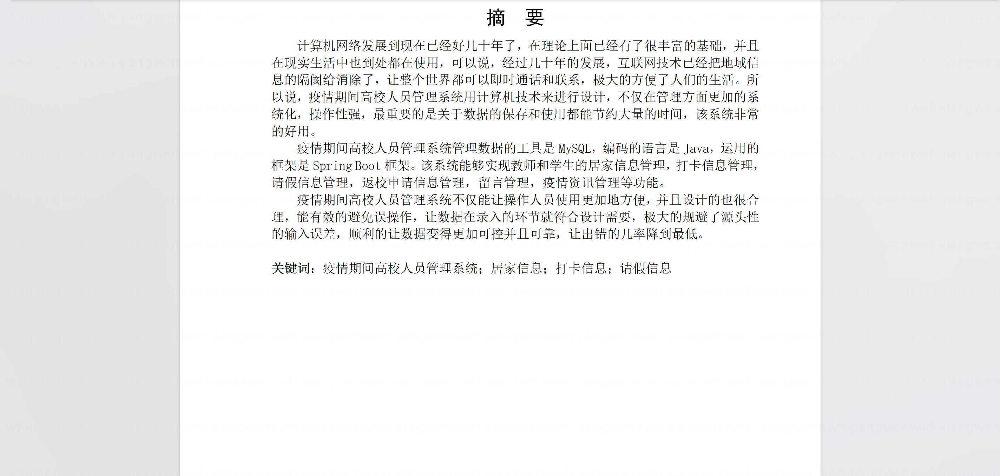

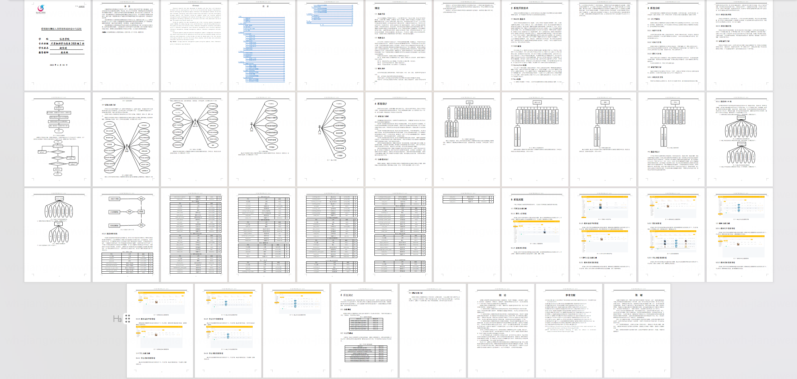

## 系统截图

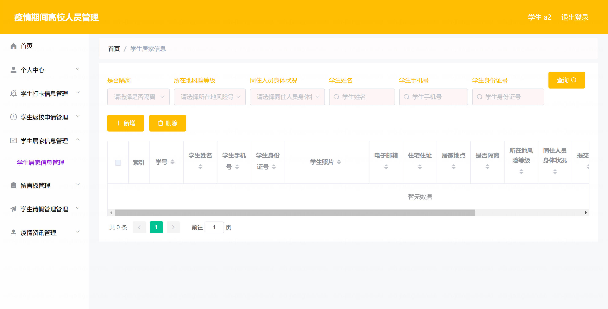

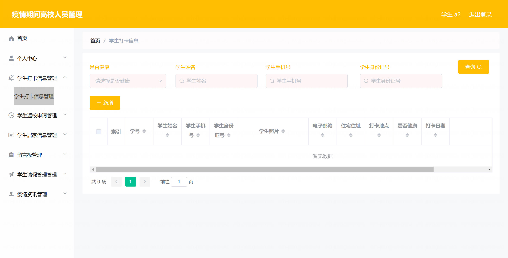

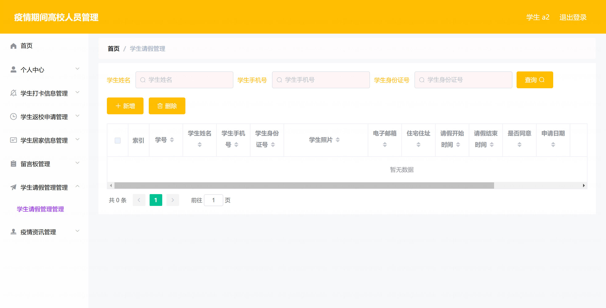

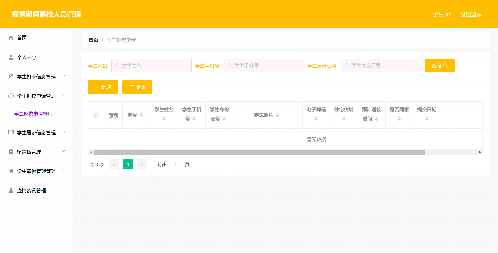

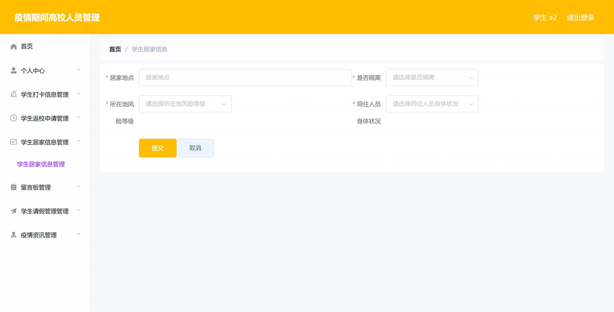

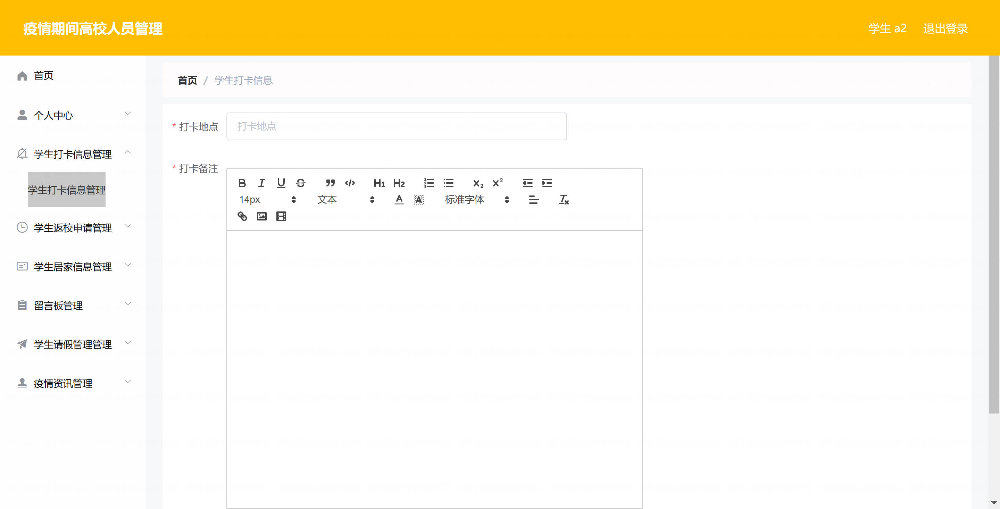

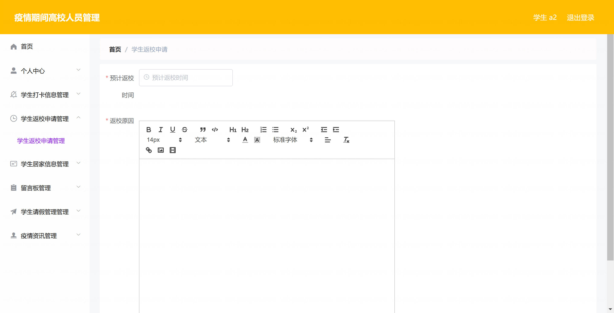

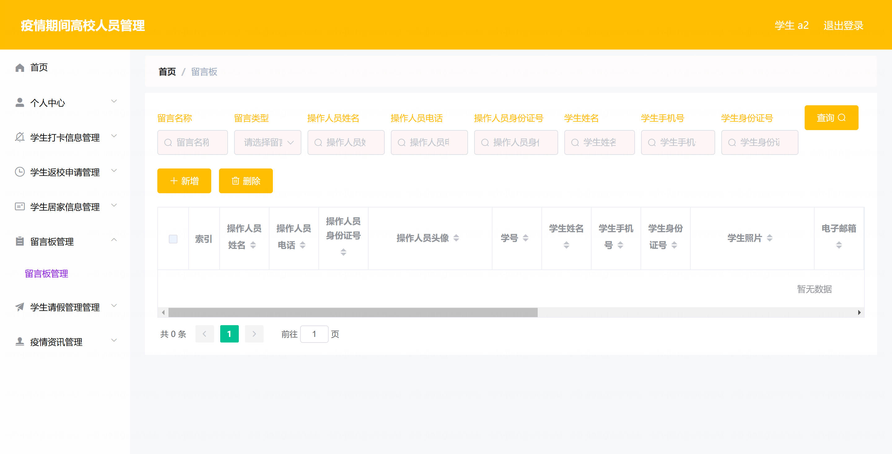

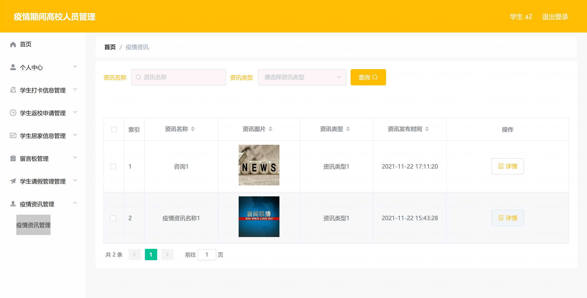

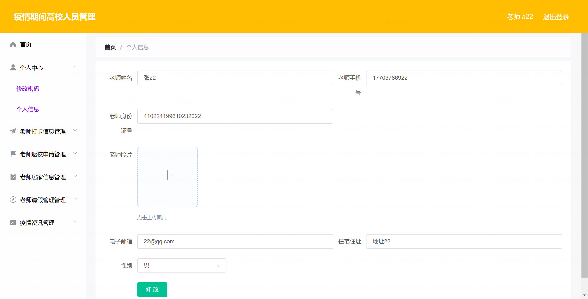